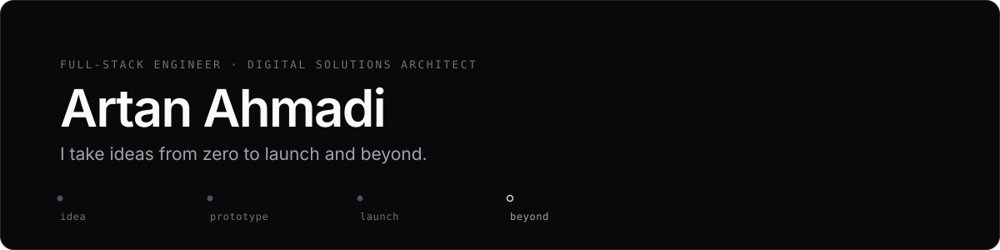

<picture>
  <source media="(prefers-color-scheme: dark)" srcset="assets/banner-dark.svg">
  <source media="(prefers-color-scheme: light)" srcset="assets/banner-light.svg">
  
</picture>

  

&nbsp;

&nbsp;

&nbsp;

&nbsp;

 

Full-stack engineer and digital solutions architect. I handle the whole product lifecycle — brand and prototype through web, mobile, e-commerce, automation, and the growth work that comes after launch. Founders get one partner instead of ten.

> I've been fascinated by computers for as long as I can remember. Not as a career choice — the machine itself is just interesting. When something catches my attention I go all the way in, and the side effect is that I usually end up shipping it.

## Currently

- Building **DevIO** — a local-first LLM client for iOS, so sensitive work never leaves the device
- Shipping client products end to end with Next.js, Flutter, and Supabase
- Poking at whatever I'm curious about this month. Compilers, robotics, a new database engine — hard to say
- **Open to freelance work, collaborations, and long-term partnerships**

## Selected Work

<table>
<tr>
<td width="50%" valign="top">

### [DevIO](https://artanahmadi.com/projects/devio)

Secure mobile interface for locally hosted LLMs. Ollama and OpenAI-compatible endpoints in one hybrid architecture — private by default, cloud only when you opt in.

[Code](https://github.com/callmeartan/devio) · [App Store](https://apps.apple.com/us/app/devio/id6743007669)

</td>
<td width="50%" valign="top">

### [Habitly](https://artanahmadi.com/projects/habitly)

Habit tracker built for speed. Local-first storage with Hive, Riverpod state, custom animations, and calendar-based streaks.

[Code](https://github.com/callmeartan/habitly) · [App Store](https://apps.apple.com/us/app/habitly-dailydo-rythm/id6738872492)

</td>
</tr>
<tr>
<td width="50%" valign="top">

### [Finzo](https://artanahmadi.com/projects/finzo)

AI financial guidance app with specialist assistants for traders, business owners, and investors. JWT auth, smart questionnaires, cross-platform.

[Live](https://finzo.live)

</td>
<td width="50%" valign="top">

### [TradeAutomation](https://artanahmadi.com/projects/trade-automation)

XAUUSD trading system with session-adaptive strategies, an MT5 file bridge, a smart position manager, and Telegram monitoring.

[Details](https://artanahmadi.com/projects/trade-automation)

</td>
</tr>
<tr>
<td width="50%" valign="top">

### [Royam Drawing](https://artanahmadi.com/projects/royam-drawing)

Persian (RTL) portrait-drawing academy. Structured video courses, phone-OTP auth, mentorship, student gallery, and course checkout — self-hosted with a custom deploy pipeline.

[Live](https://royakhani.com)

</td>
<td width="50%" valign="top">

### [LinkQuota](https://artanahmadi.com/projects/linkquota)

Edge relay plus a VPS-side VLESS subscription manager. Per-customer quota, expiry, health checks, and reproducible setup docs — sanitized for public release.

[Code](https://github.com/callmeartan/LinkQuota)

</td>
</tr>
</table>

<b>More work</b>

 

| Project | What it is | Stack |
| --- | --- | --- |
| [Silver Cam](https://silver-cam.com) | Camera storefront with conversion-focused product pages and cart flow | Next.js · TypeScript · Supabase |
| [Glowra Makeup](https://glowramakeup.com) | Beauty e-commerce with a responsive shopping flow | React · Next.js |
| [The Berlinery](https://the-berlinery.web.app) | Pastry shop site — menu, gallery, reviews, locations | Next.js · Tailwind · Firebase |
| [MacMasters](https://artanahmadi.com/projects/macmasters) | Real estate app with AI property search and real-time chat | Flutter · Firebase |
| [Photography](https://photo.artanahmadi.com) | Static portfolio with a two-tier image pipeline and lightbox viewer | HTML · CSS · JS |

## What I Build

<table>
<tr>
<td width="33%" valign="top"><b>Brand & strategy</b> Identity and positioning so a product looks intentional from day one.</td>
<td width="33%" valign="top"><b>Web & mobile</b> Fast, responsive products in Next.js, React, and Flutter.</td>
<td width="33%" valign="top"><b>E-commerce & payments</b> Storefronts, carts, and checkout set up to actually sell.</td>
</tr>
<tr>
<td width="33%" valign="top"><b>Automation & admin</b> Dashboards and workflows that remove repetitive work.</td>
<td width="33%" valign="top"><b>AI integration</b> Assistants and local-first LLM workflows inside real products.</td>
<td width="33%" valign="top"><b>Maintenance & growth</b> Performance, SEO, and iteration after launch.</td>
</tr>
</table>

## Stack

<table>
<tr>
<td valign="top"><b>Languages</b>  TypeScript JavaScript Python Dart SQL C++</td>
<td valign="top"><b>Product</b>  Next.js React Flutter Supabase Tailwind CSS Riverpod / BLoC</td>
<td valign="top"><b>AI</b>  LLM integration Ollama / local models Hybrid architecture Prompt engineering Privacy-first design</td>
<td valign="top"><b>Infra</b>  Linux Nginx PostgreSQL Vercel / Netlify Firebase Git &amp; CI/CD</td>
</tr>
</table>

## Background

**B.Sc. Computer Engineering** — Beykent University, Istanbul · Class of 2025 
Mobile application development, data structures and algorithms, software engineering, database systems.

## Get In Touch

Have something you want built, or want to talk through whether it's worth building? I usually reply within 24–48 hours.

**Email** — [artanahmadi@icloud.com](mailto:artanahmadi@icloud.com) &nbsp;·&nbsp; **Telegram** — [@callmeartan](https://t.me/callmeartan) &nbsp;·&nbsp; **Site** — [artanahmadi.com](https://artanahmadi.com)

Based in Rasht, Iran. Working with founders anywhere.

GitHub activity

 

&nbsp;

